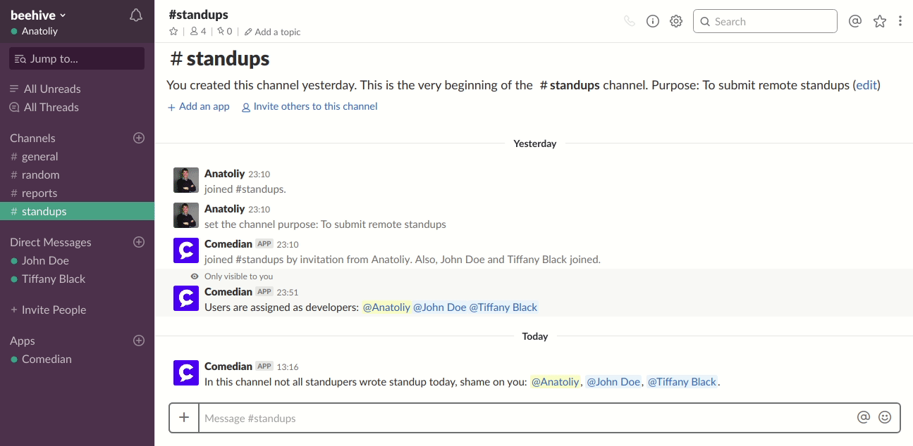

<p align="center">


<p align="center"> Stand up bot for slack to help you with remote stand up meetings automation </p>

<div align="center">


[](https://coveralls.io/github/maddevsio/comedian)
[](https://goreportcard.com/report/github.com/maddevsio/comedian)
[](https://opensource.org/licenses/mit-license.php)
[](https://godoc.org/github.com/maddevsio/comedian)

</div>
</p>



## How can comedian help you to spend less time on the stand up meetings

First, you need to start remote standups meetings in Slack. Create a channel for it. Then add Comedian and ask your team to write messages with the following template tagging bot in the message

1. What I did yesterday(with tasks description)
2. What I'm going to do today
3. What problems I've faced.

The comedian will store it for you and give a convinient reports for you about stand ups.

## Getting started

These instructions will get you a copy of the project up and running on your local machine for development and testing purposes. 

```
mkdir -p $GOPATH/src/github.com/maddevsio/
cd $GOPATH/src/github.com/maddevsio/
git clone https://github.com/maddevsio/comedian
```

Create "app" in slack workspace: https://api.slack.com/apps
In the drop-down list at the top select the created "app"
In the menu, select "Slash Commands".

Create a public HTTPS URL for Comedian on your development machine with [ngrok](https://ngrok.com/product)

Create the following commands (Request URL for all commands: ```http: // <ngrok https URL> /commands ``` ):

| Name | Hint | Description | Escape option |
| --- | --- | --- | --- |
| /add | @user @user1 / (admin, pm, developer) | Adds a new user with selected role | V |
| /delete | @user @user1 / (admin, pm, developer) | Removes user with selected role  | V |
| /list | (admin, pm, developer) | Lists users with selected role | - |
| /standup_time_set | hh:mm | Set standup time | - |
| /standup_time | - | Show standup time in current channel | - |
| /standup_time_remove | - | Delete standup time in current channel | - |
| /timetable_set | @user1 @user2 on mon tue at 14:02 | Set individual standup time | V |
| /timetable_show | @user1 @user2 | Show individual standup time for users | V |
| /timetable_remove | @user1 @user2  | Delete individual standup time for users | V |
| /report_by_project | #channelID 2017-01-01 2017-01-31 | gets all standups for specified project for time period | - |
| /report_by_user | @user 2017-01-01 2017-01-31 | gets all standups for specified user for time period | - |
| /report_by_user_in_project | #project @user 2017-01-01 2017-01-31 | gets all standups for specified user in project for time period | - |

Select "Bot users" in the menu.
Create a new bot user.

Go to "OAuth & Permissions"
Copy Bot User OAuth Access Token ("xoxb-___________________")

Add access tokens and additional setup to your docker-compose.yml 

Run:
```
sudo make
docker-compose up
```

Please read more instructions in [Comedian Wiki](https://github.com/maddevsio/comedian/wiki)

Use Comedian Images from [DockerHub](https://hub.docker.com/r/anatoliyfedorenko/comedian/tags/) 

## Team Monitoring 
Please note that Team Monitoring Servise is developed only for internal use of Mad Devs LLC, therefore when configuring Comedian, you may turn this feature off. (look at env variables) 

Variables assosiated with TM are:
```
COMEDIAN_ENABLE_TEAM_MONITORING=false
COMEDIAN_COLLECTOR_TOKEN=_______________________
COMEDIAN_COLLECTOR_URL=_________________________
```

## Issues

Feel free to send pull requests. Also feel free to create issues.

## License

MIT License

Copyright (c) 2018 Mad Devs

Permission is hereby granted, free of charge, to any person obtaining a copy of this software and associated documentation files (the "Software"), to deal in the Software without restriction, including without limitation the rights to use, copy, modify, merge, publish, distribute, sublicense, and/or sell copies of the Software, and to permit persons to whom the Software is furnished to do so, subject to the following conditions:

The above copyright notice and this permission notice shall be included in all copies or substantial portions of the Software.

THE SOFTWARE IS PROVIDED "AS IS", WITHOUT WARRANTY OF ANY KIND, EXPRESS OR IMPLIED, INCLUDING BUT NOT LIMITED TO THE WARRANTIES OF MERCHANTABILITY, FITNESS FOR A PARTICULAR PURPOSE AND NONINFRINGEMENT. IN NO EVENT SHALL THE AUTHORS OR COPYRIGHT HOLDERS BE LIABLE FOR ANY CLAIM, DAMAGES OR OTHER LIABILITY, WHETHER IN AN ACTION OF CONTRACT, TORT OR OTHERWISE, ARISING FROM, OUT OF OR IN CONNECTION WITH THE SOFTWARE OR THE USE OR OTHER DEALINGS IN THE SOFTWARE.
